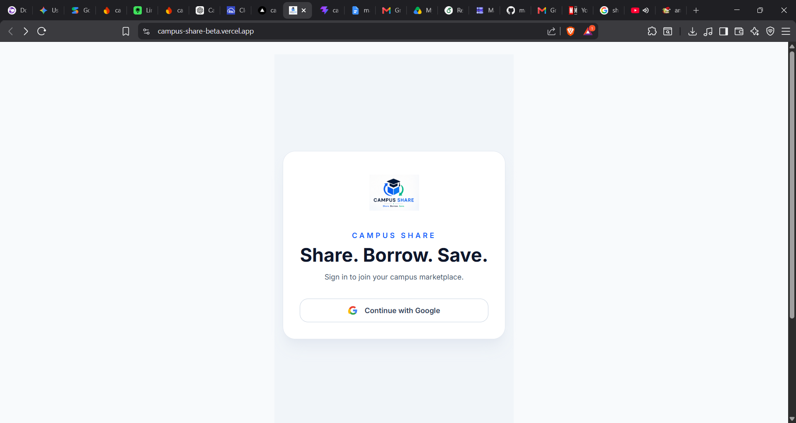
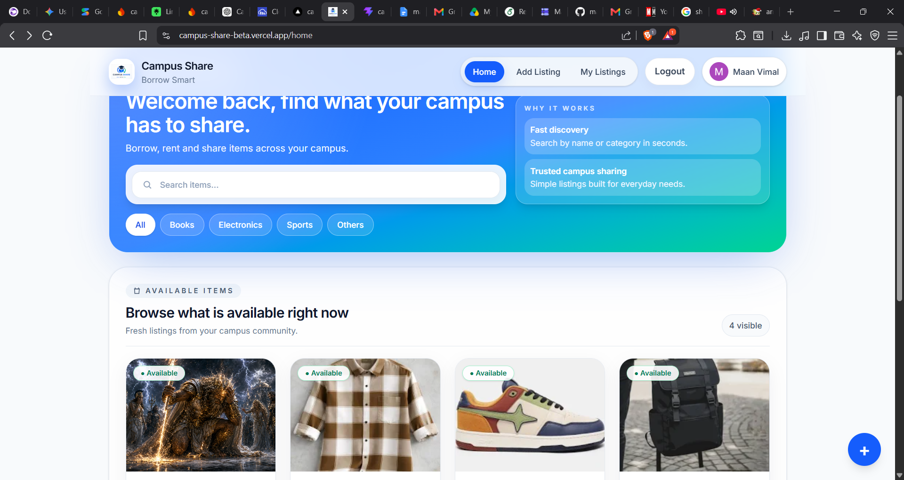
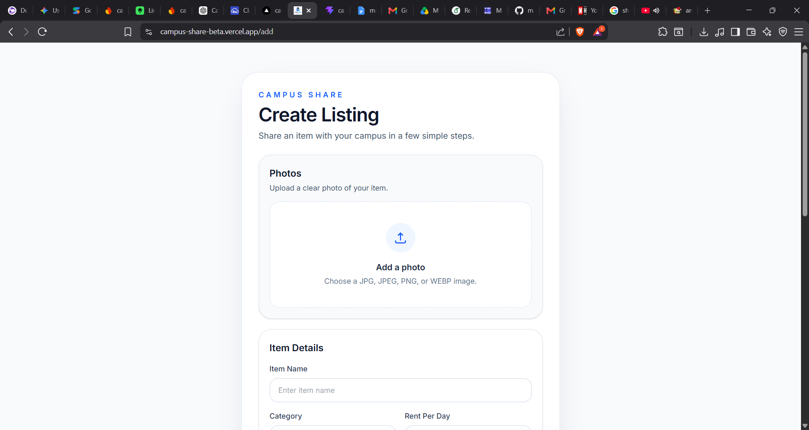
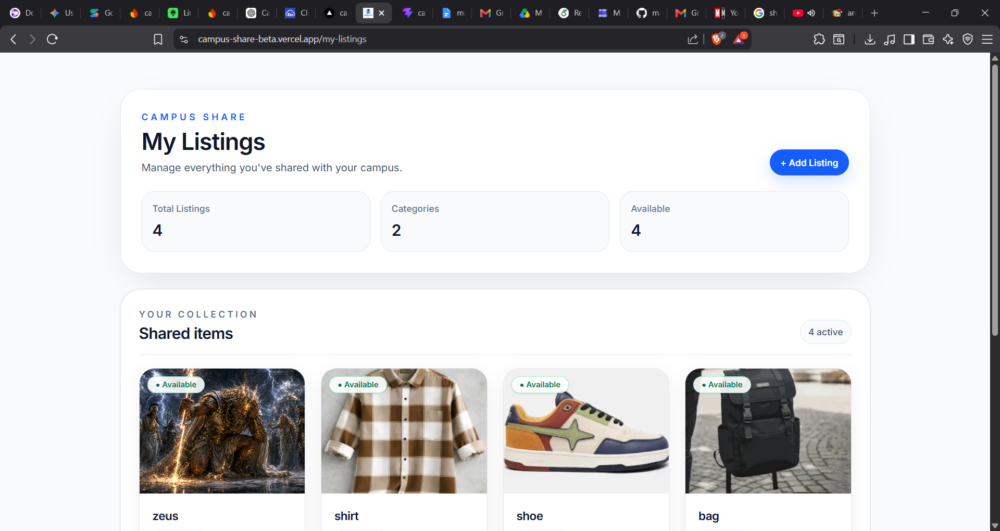
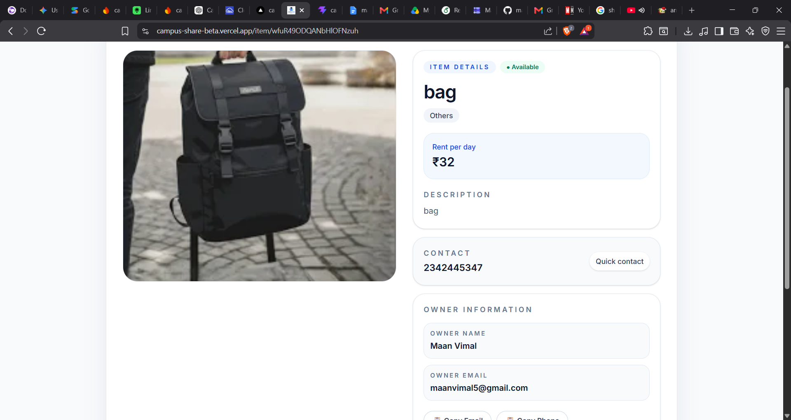

# 🎓 Campus Share

A modern campus rental marketplace that enables students to rent and share items within their college community.

Campus Share helps students list books, electronics, sports equipment, and everyday essentials for short-term rentals, making campus resource sharing simple, affordable, and convenient.

---

## 🚀 Live Demo

🌐 https://campus-share-beta.vercel.app

---

## ✨ Highlights

- Secure Google Authentication
- Modern responsive interface
- Fast search and category filtering
- Cloudinary image uploads
- Personal dashboard for managing listings
- Toast notifications
- Skeleton loading
- Confirmation dialogs
- Mobile-friendly design

## 🛠 Tech Stack

| Technology | Purpose |
|------------|---------|
| React (Vite) | Frontend |
| Tailwind CSS | Styling |
| Firebase Authentication | User Authentication |
| Firestore | Database |
| Cloudinary | Image Storage |
| React Router | Routing |
| React Hot Toast | Notifications |
| Vercel | Deployment |

---

## 📷 Screenshots

### Login



---

### Home



---

### Add Listing



---

### My Listings



---

### Item Details



## 📂 Project Structure

```
src/
├── assets/
├── components/
├── pages/
├── services/
├── firebase.js
├── App.jsx
└── main.jsx
```

---

## 🚀 Installation

Clone the repository

```bash
git clone <repository-url>
```

Install dependencies

```bash
npm install
```

Run the development server

```bash
npm run dev
```

Build for production

```bash
npm run build
```

---

## 💡 Future Improvements

- In-app chat between students
- Booking calendar
- Wishlist
- Ratings & Reviews
- User profiles
- Notifications
- Admin Dashboard
- Payment Integration

---

## 👥 Contributors

- **Maan Vimal**
- **Mahima Prajapati**

---

## 📜 License

This project was developed for academic purposes as part of a college project.

---

## ❤️ Built With

- React
- Firebase
- Firestore
- Cloudinary
- Tailwind CSS
- Vite

---

## 📬 Contact

For suggestions or improvements, feel free to reach out through GitHub.